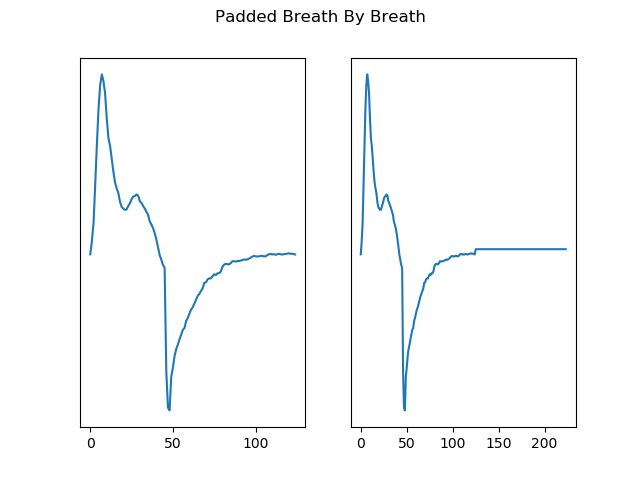
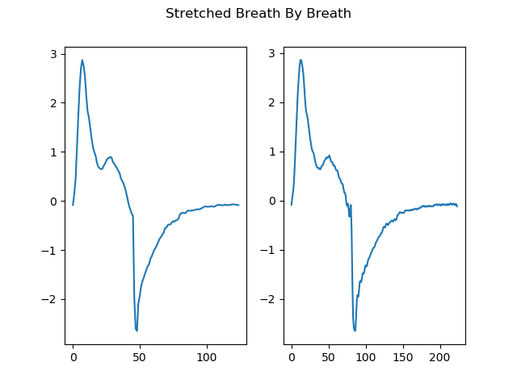
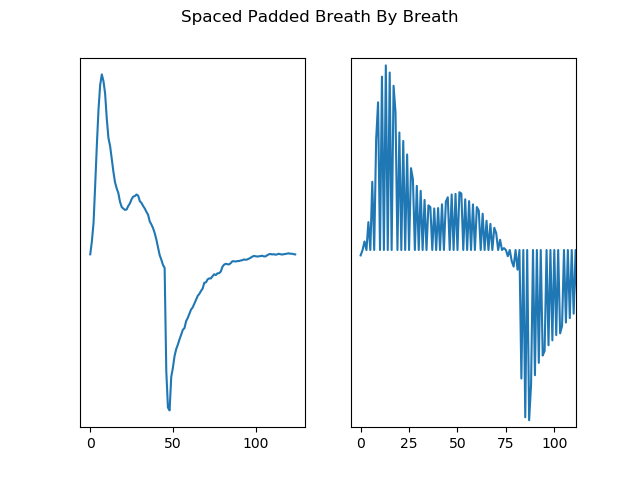
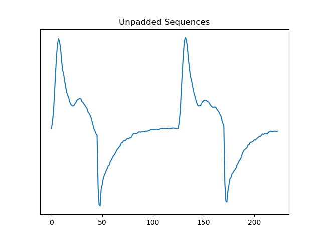

# deepards
Deep Learning for ARDS Detection with Ventilator Waveform Data

## Install
Install using anaconda. First [install anaconda](https://docs.anaconda.com/anaconda/install/) on your machine then setup a new environment

    conda env create -f environment-py3.yml
    conda activate deepardsdev3

Finally install the deepards package

    pip install -e .

Now go to the deepards directory and make a results directory so that your model can store its
results for future analysis.

    cd deepards
    mkdir -p {results,gradcam_results,prototype_results}

## Quickstart

We will just showcase a single model with a single network. Here we can just run an
experiment with a standard cnn_linear network. First download our anonymous dataset
from [box.](https://ucdavis.box.com/s/yuawpixlokf25bt71doz6g3mzdqr0ehj) Then run the training script

    python train_ards_detector.py \
    -co experiment_files/unpadded_centered_nb20_cnn_linear.yml \
    --train-from-pickle anon-unpadded_centered_sequences-nb20-kfold.pkl

## Running with Config File

Because it can be frustrating to remember the arguments that you used for a specific experiment we
allow the creation of experiment configuration files to allow override of default parameters. Default
parameters are kept in `defaults.yml`. If you want to override the defaults create a new YAML file in
the `experiment_files` directory.  There are a number of examples in this directory but we will go through one.

If we open `experiment_files/train_frac25.yml` we will see some of the arguments.

    kfolds: 5
    dataset_type: unpadded_centered_sequences
    n_sub_batches: 20
    train_from_pickle: unpadded_centered_sequences-nb20.pkl
    train_pt_frac: .25
    clip_grad: true
    clip_val: 0.01
    network: cnn_linear

Here we see we are setting a variety of different parameters. Note that we can set boolean parameters
as well by setting the variable names to true/false. Variable names in these files will mirror CLI
variable names. So if the CLI variable name is `--tranform-probability`, then the variable name will
be `transform_probability`. If there is a shorthand CLI name like `-dp` it will *NOT* be recognized, instead
you need to use the full variable name: so `data_path` would be the correct usage.

Finally once you have completed a config override file you can specify it on the CLI path using

    python train_ards_detector.py -co experiment_files/my_experiment.yml

Because you have already set all of your arguments in your experiment file, you will not have to set
them on the command line. If you still want to override an argument in the experiment file you can
just by using the command line. The command line will *always* override any argument set in
an experiment file.

## Dataset Types

The `train_ards_detector.py` has a flag named `-dt`. This stands for `--dataset-type`. Different
dataset types correspond with different ways for modeling the ARDS detection problem. These different methods
all use relatively the same data, but in a variety of different ways. As of 2019-05-10 types are:

* **padded_breath_by_breath** - Simplest dataset. Each breath extracted, and then padded if necessary to a certain sequence size (usually 224 for resnet). Sequential breaths are then clustered together into a sub-batch of a certain size
* **stretched_breath_by_breath** - Instead of padding, breaths are stretched to the maximum extent of a certain sequence size via upsampling.
* **spaced_padded_breath_by_breath** - Stretches the breath similar to above, but instead of upsampling, we just pad with 0's. Probably one of the weirder modeling techniques and didn't yield great results
* **unpadded_sequences** - Instead of having 1 single breath fed into a CNN, we utilize sequences of multiple breaths until we cannot fit any more breaths in the sequence.
* **padded_breath_by_breath_with_full_bm_target** - Utilizes the padded breath by breath method, but sets breath metadata as its target instead of an ARDS/no ARDS classification. This is used for pretraining a CNN and then later you can apply it to ARDS detection.
* **padded_breath_by_breath_with_limited_bm_target** - Utilizes the padded breath by breath method, but sets a limited set of breath metadata as its target instead of an ARDS/no ARDS classification. This is used for pretraining a CNN and then later you can apply it to ARDS detection.
* **padded_breath_by_breath_with_flow_time_features** - Utilizes the padded breath by breath method, and adds breath metadata so the model can use that for classification decisions as well.
* **unpadded_centered_sequences** - Like unpadded sequences, but always starts with the beginning of a new breath. This helps correct for translational variability in CNN.

I understand that this might be a bit to understand in writing so I have also added images to help visualize how data is being processed.





Note that the spaced padding is zoomed so you can see what's happening.




### Best Performers
We have found that `unpadded_centered_sequences` performs best across all of the datasets.

## GradCam
Gradcam can be used for explaining model predictions. The main script that we use for this is
the `patient_gradcam.py` script. This script requires 4 primary inputs to function properly

1. model_path - the script requires a path to a save pytorch model that it can use for gradcam
2. --pickled-data-path - The script needs a dataset of processed information to draw from to make gradcam inference
3. --fold - Most of our datasets use kfolds. So we require the input of a kfold capable dataset with a specific fold number to analyze.
4. --ops - Choose which operations you want to perform with gradcam. There are a number of different operations available. *all* will process all available operations. *averages* will generate the representation of an average breath and overlay gradcam on it on a per-patient basis. *medians* will generate the representation of a median breath and then process gradcam with this breath on a per-patient basis. *sample_seqs* will process gradcam for each batch by sampling a single sequence from a batch and overlaying gradcam results on it.

Example Usage:
```
python patient_gradcam.py \
saved_models/densenet-fold3.pth \
--pickled-data-path /path/to/saved/dataset.pkl \
--fold 3 \
--ops medians
```
### GradCam Results

Results for operations will be stored with the following directory structure starting at
the `deepards/deepards` directory

```
gradcam_results
|
----patient_averages
|   |
|   ----ards
|   |   |    patientXXX.png
|   ----non_ards
|   |   |    patientYYY.png
|
----patient_medians
|   |
|   ----ards
|   |   |    patientXXX.png
|   ----non_ards
|   |   |    patientYYY.png
|
----sampled_sequences
|   |
|   ----ards
|   |   |
|   |   ----patientXXX
|   |   |   |    seq-1.png
|   |
|   ----non_ards
|   |   |
|   |   ----patientYYY
|   |   |   |    seq-2.png
```

## Only Using A Fraction of Total Available Training Patients
If you only want to use a fraction of the training patients available for experimentation then you
should use the `--train-pt-frac` argument to set the fraction of patients in your dataset you want
to use.
Normally the number of patients in a training kfold is 80, so for instance if you set `--train-pt-frac 0.1`,
then this would only take 10% of the available training patients. Doing this you would randomly select
8 patients for use in training. We split evenly by pathophysiology, so you'd get 4 non-ARDS and 4 ARDS
patients in training.

Example of usage on CLI:

    python train_ards_detector.py --train-pt-frac 0.25

Assuming you have a training dataset of 80 patients again, asking for 25% of your patients would
give you a training dataset of 20 patients to use.

## Visualizing Results
Now that you've run everything you will want to visualize your results in an informative way. You can do so using the `visualize_results.py` script. You can use this
a few different ways.

 1. Pass in the starting time of a run. This starting time is given to you via the CLI

        python visualize_results.py -st 1561106349

 2. Pass in the experiment name you wish to compare. This will allow you to compare different parameters in an experiment

        python visualize_results.py -exp test_learning_rate_changes

## Getting Results Across Many Runs
It is common in deep learning to run an experiment multiple times and to average the results to obtain a more clear picture
of what your results will statistically look like. We have also written a script to help users with this called `mean_metrics.py`. If you provided an experiment name to your training script, then you can tell `mean_metrics.py` to aggregate results

    python train_ards_detector.py -lr .001 --kfolds 5 -exp test_learning_rate_changes
    python train_ards_detector.py -lr .001 --kfolds 5 -exp test_learning_rate_changes

    # now aggregate results
    python mean_metrics.py -e test_learning_rate_changes

`mean_metrics.py` will first plot individual kfolds and the average performance of the model over a number of epochs. The script
will also drop into an IPython interpreter when it's done. You can then poke around at different results variables to determine how well the model was doing.
To get aggregate results you can do

    In [1]: exp_results

to see overall performance. To see more individualized performance metrics you can type

    In [1]: mean_df_stats

## Pretraining
It has been noted that training a neural network on a related task and then applying it to your dataset in question has
either improved results of the classifier or improved the speed at which a classifier converges. We can do this using the ARDS
dataset by training the neural network to determine specific metadata properties of a breath. These properties can be computed
computationally using non-ML algorithms, but the advantage of using them in a neural network is that learning these properties
can teach the network to recognize breaths before it is applied to the ARDS dataset.

### Dataset
First we need a dataset of breaths and corresponding breath metadata. We can set this up by using the `create_separate_breath_meta_dataset.py` script. We should ensure the
script trains on a dataset of patients that **do not** have relation to the current ARDS
cohort. Of course evaluating the performance of the regressor on ARDS dataset patients
is OK though. This script operates by K-means clustering and then randomly picks a number
of breaths from the cluster. This helps to ensure that we have a heterogeneous sampling
of breaths to draw from so that we are not overtraining our regressor on a single breath type. The script will ensure that a given number of breaths are chosen from each cluster.

First ensure the path to patient directories has no relation to the current ARDS dataset.

You can create the dataset:

    python create_separate_breath_meta_dataset.py -dp /path/to/patient/dirs --clusters 75 -bp 100

This implementation will find 75 clusters of breaths from each patient in our dataset and
then will extract a maximum of 100 breaths from each of these clusters. At maximum this
will ensure we get 7500 breaths from each patient.

### Pretraining
Once the dataset is created you can train your regressor on it.

    python train_ards_detector.py -n cnn_regressor --cuda --save-model pretrained-model.pth -dp /path/to/breath/meta/dataset -dt padded_breath_by_breath_with_limited_bm_target

This will save a deep CNN model that you can use to analyze your breath data in future runs.
