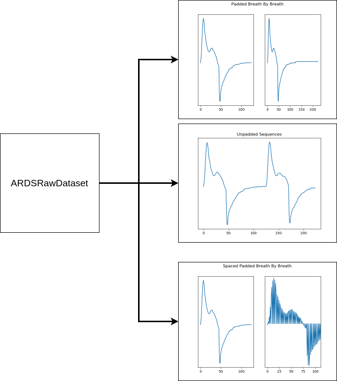
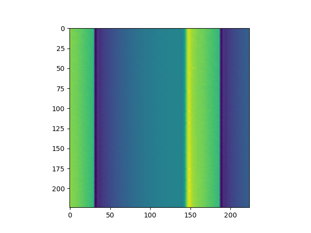

# Code Architecture

## Dataset Code (`dataset.py`)

### 1D data with `ARDSRawDataset`
Idea: we have multiple different ways we want to format our input data, so we need
flexible code that allows us to do this. For instance our 1D CNN data is expected
to output data in at least 3 different ways. Each way corresponds to a unique experiment.

Naturally we have desired to run as many experiments as possible. So as experiments
have been added, the code has grown in function and complexity.

### Data Processing with `ARDSRawDataset`
The ARDSRawDataset class operates by taking a directory where raw ventilator files are
located, the way data should be formatted and a few other arguments. The processing
operates by iterating through each patient and processing all data files for them.
All processed data is stored into an internal variable named `self.all_sequences`. Each item
in `self.all_sequences` is a tuple of variable length, but usually it is structured like this

    (
        patient_id,
        breath_data,
        target,
        time_data,
    )

Finally, when the training code requests data, the `__getitem__` method is invoked and processed data is retrieved from memory in `self.all_sequences` and is then used in machine
learning.

### 2D data with `ImgARDSDataset`
Idea: rather than formatting ventilator data as a 1D waveform, we can format it as an
image and take advantage of all the previous work done in computer vision for our
problem. In this manner data is formatted as a 2D image with each row being a single
breath, and each pixel being the flow observation at a specific time for a breath. In
practice our image looks like this:

Note that bright regions correspond with areas where the patient is inhaling. Darker
regions are where the patient is exhaling.

### Data Processing with `ImgARDSDataset`
Data is processed slightly differently here. `ImgARDSDataset` needs an instance of
`ARDSRawDataset` to perform processing. Once it is provided, `ImgARDSDataset` then extracts all
possible information from `ARDSRawDataset` and forms it into an image. Images are then
stored in the `self.all_sequences` variable. As above, `self.all_sequences` stores data
in format

    (
        patient_id,
        img_data,
        target,
        time_data,
    )

This data is then gathered and returned to the ML algorithms using `__getitem__`.

### Testing

Dataset code can be tested by running

    python dataset.py

In order to test it on personal development, modify code at the bottom of the file
under the

    if __name__ == '__main__':

code block
